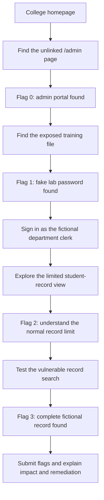

# Beginner CTF Flow

This diagram shows the intended first-time learner journey for the Northbridge College Portal lab.

## Teaching sequence

1. A hidden route is not access control.
2. Web-accessible files must not contain secrets.
3. User input must be handled safely in database searches.
4. Findings should be documented with their impact and a remediation recommendation.

All flags, records, and credentials in this exercise are fictional training data inside the isolated lab VM.
